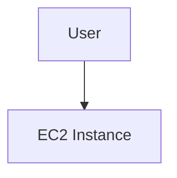
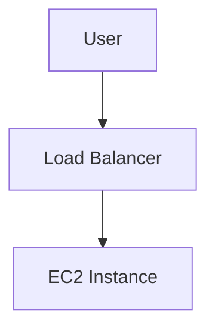
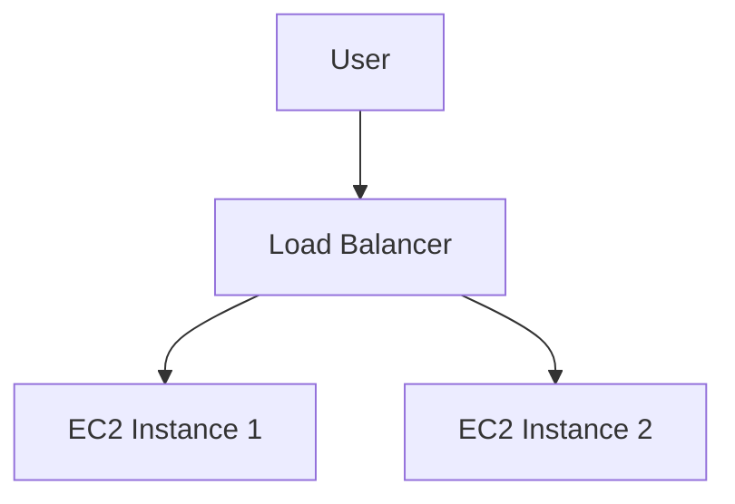
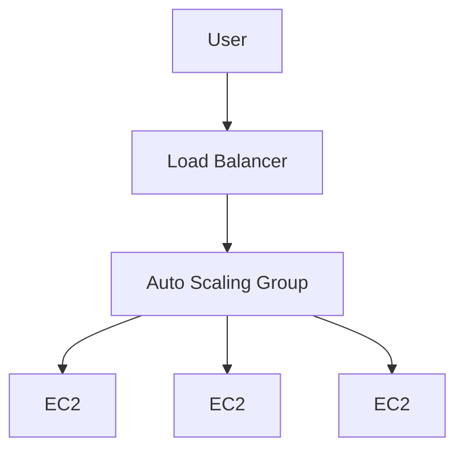
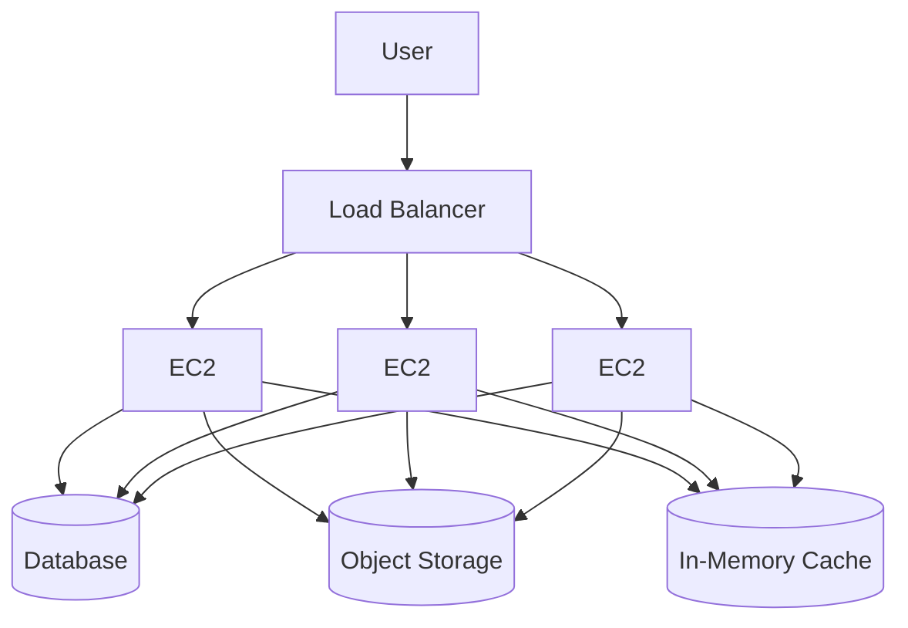
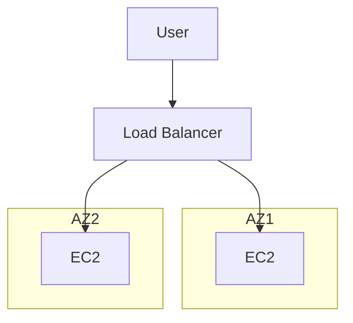
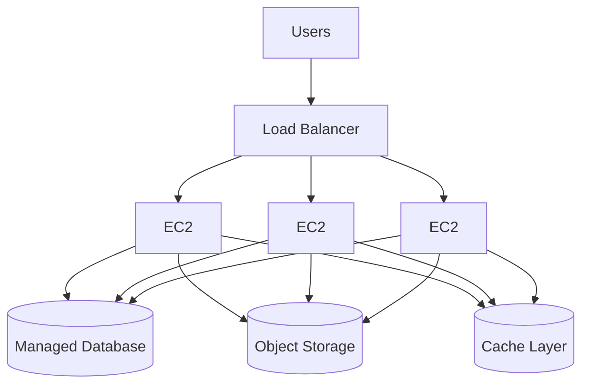
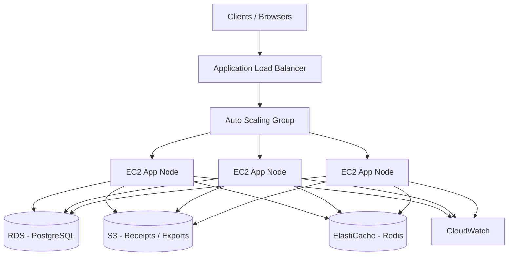

# AWS Architecture Evolution: From Single EC2 to Production-Grade System

This project documents the evolution of a basic single-instance deployment into a scalable, highly available, and production-ready architecture on AWS. It reflects industry best practices for system design, reliability, and cost optimization.

## Objectives 

* Demonstrate infrastructure evolution in real-world systems
* Apply scaling strategies (vertical and horizontal)
* Implement stateless architecture
* Achieve high availability and fault tolerance
* Introduce safe deployment strategies

## Stage 0: Single EC2 Instance

A single EC2 instance hosts both the application and database.

### Architecture: 

#### Limitations

* Single point of failure
* No scalability
* Downtime during updates
* Limited performance under load

## Stage 1: Introduce Load Balancer

A load balancer is introduced to route traffic and perform health checks. This abstracts the compute layer from direct user access.

### Architecture:

#### Benefits

* Improved reliability through health checks
* Foundation for horizontal scaling

## Stage 2: Multiple EC2 Instances (Manual Scaling)

Additional instances are manually provisioned to distribute traffic.

### Architecture:

### Benefits

* Increased capacity
* Basic fault tolerance

### Limitations

* Manual scaling
* Risk of configuration inconsistencies

## Stage 3: Auto Scaling Group

An Auto Scaling Group (ASG) manages instance lifecycle based on defined capacity parameters.

### Architecture:

### Benefits

* Automatic provisioning and termination of instances
* Improved resilience

## Stage 4: Scaling Policies

Scaling policies define how the system responds to demand.

### Example Policies

* Scale out: CPU utilization exceeds 70%
* Scale in: CPU utilization drops below 30%

### Benefits

* Dynamic resource allocation
* Cost optimization

## Stage 5: Launch Templates

Launch templates define standardized configurations for instances, including:

* Amazon Machine Image (AMI)
* Instance type
* Security groups
* User data scripts

### Benefits

* Consistency across instances
* Faster and reliable scaling operations

## Stage 6: Stateless Architecture

Application state is externalized to managed services such as databases, object storage, and caching layers.

### Architecture:

### Benefits

* Instances become stateless and replaceable
* Enables true horizontal scaling
* Improves reliability and data durability

## Stage 7: Multi-AZ Deployment

Instances are distributed across multiple Availability Zones.

### Architecture

### Benefits

* High availability
* Fault isolation

## Stage 8: Rolling Deployments

Rolling deployments update instances incrementally to avoid downtime.

### Process

1. Remove instance from load balancer
2. Deploy updated version
3. Perform health checks
4. Reintroduce instance into traffic pool
5. Repeat across all instances

### Benefits

* Continuous availability
* Reduced deployment risk

## Stage 9: Production Enhancements

### Components

* Monitoring and observability
* Alerting mechanisms
* CI/CD pipelines
* Infrastructure as Code

### Benefits

* Operational visibility
* Faster incident response
* Automated deployments

## Final Architecture

## Cost and Value Evolution

| Stage             | Cost      | Outcome                          |
| ----------------- | --------- | -------------------------------- |
| Single EC2        | Low       | Basic functionality              |
| Load Balanced     | Moderate  | Improved reliability             |
| Auto Scaling      | Optimized | Efficient scaling                |
| Full Architecture | Higher    | High availability and resilience |

## Key Principles

* Design for failure
* Prefer stateless application layers
* Automate infrastructure and scaling
* Monitor system performance continuously
* Optimize for both cost and reliability

## Real-World Use Case: SaaS Payments Platform (Fintech)

### Context

A multi-tenant SaaS platform processes online payments for merchants. 

Requirements include:
- high availability
- low latency
- data integrity
- compliance with regional data regulations.

### Workload Characteristics

* Spiky traffic (campaigns, peak shopping periods)
* Read-heavy APIs (dashboards, transaction history)
* Write-heavy paths for payment processing
* Strict reliability and consistency requirements

### Architecture Mapping:

### Component Responsibilities

* **Application Load Balancer**: TLS termination, routing, health checks
* **Auto Scaling Group**: Scales application nodes based on CPU and request rate
* **EC2 Application Nodes**: Stateless services (APIs, workers)
* **RDS (PostgreSQL)**: Transactional data (payments, users, ledgers)
* **S3**: Storage for receipts, reports, and exports
* **ElastiCache (Redis)**: Session storage, caching, rate limiting
* **CloudWatch**: Metrics, logs, alarms

### Data Flow (Payment Request)

1. Client sends payment request to ALB
2. ALB routes to a healthy EC2 instance
3. App validates request and writes transaction to RDS
4. Cache is updated/invalidated in Redis
5. Receipt is stored in S3 (optional async)
6. Response returned to client

### Scaling Strategy

* **Horizontal scaling** via ASG on CPU and request count
* **Read replicas** on RDS for read-heavy endpoints
* **Caching** via Redis to reduce database load

### High Availability

* EC2 instances distributed across multiple Availability Zones
* RDS Multi-AZ deployment for failover
* ALB routes only to healthy instances

### Deployment Strategy

* Rolling deployments for minor releases
* Blue/Green deployments for schema or high-risk changes

### Security Considerations

* Private subnets for EC2 and RDS
* Security groups limiting inbound traffic
* Encryption at rest (RDS, S3) and in transit (TLS)
* IAM roles for least-privilege access

### Observability

* CloudWatch metrics: CPUUtilization, RequestCount, Latency
* Centralized logs for debugging and auditing
* Alarms for scaling triggers and error rates

### Cost Considerations

* Scale out during peak, scale in during off-peak
* Use reserved instances or savings plans for baseline capacity
* Offload static assets to S3 to reduce compute cost

## Conclusion

This project demonstrates the transition from a simple deployment model to a production-ready architecture. It highlights the importance of scalability, fault tolerance, and operational maturity in modern cloud systems.
