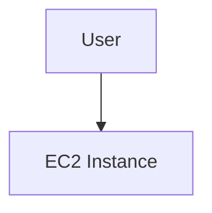
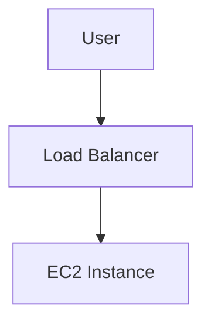
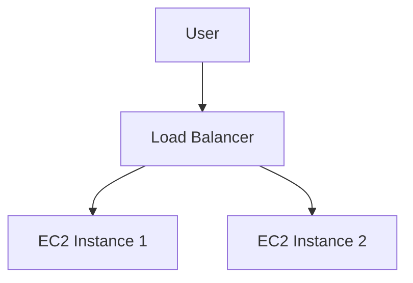
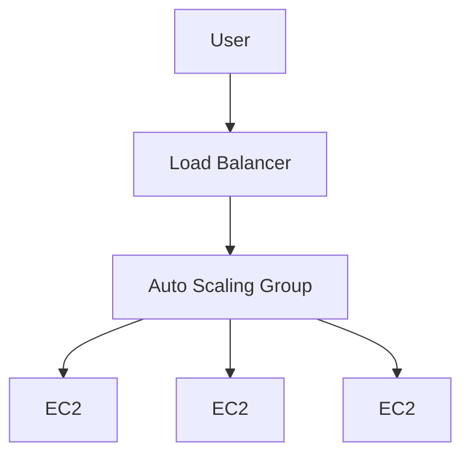
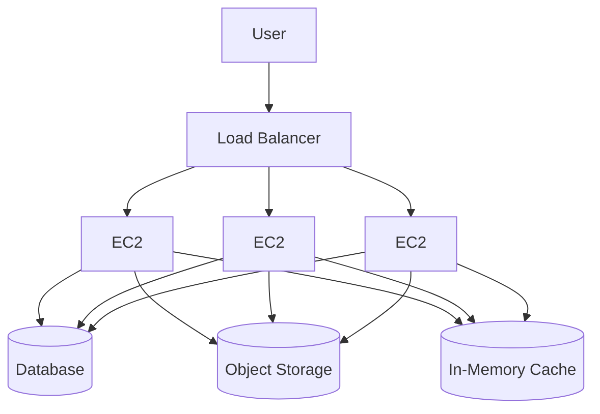
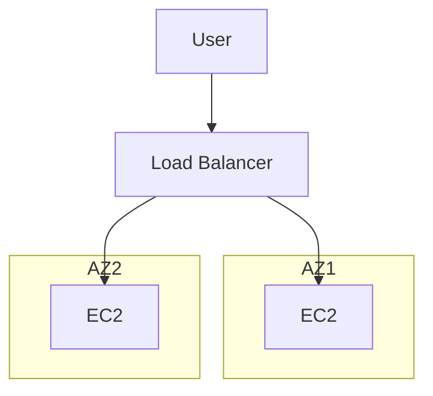
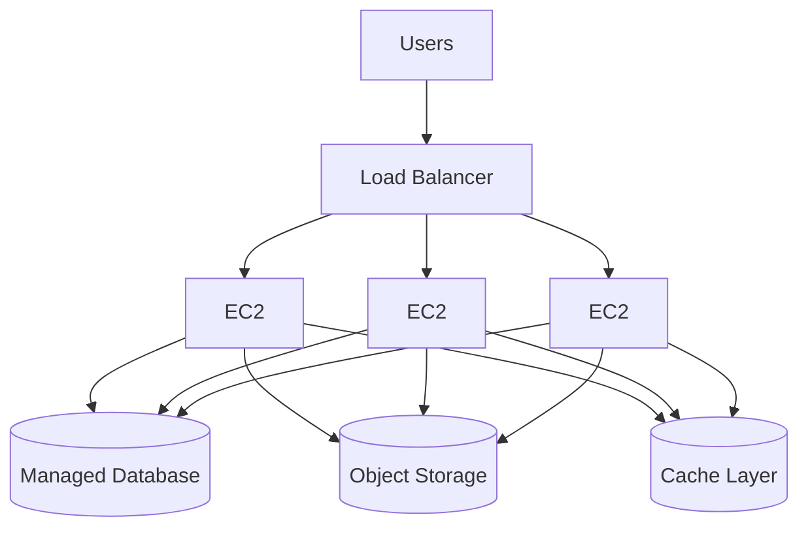

# AWS Architecture Evolution: From Single EC2 to Production-Grade System


This project documents the evolution of a basic single-instance deployment into a scalable, highly available, and production-ready architecture on AWS. It reflects industry best practices for system design, reliability, and cost optimization.

## Objectives 

* Demonstrate infrastructure evolution in real-world systems
* Apply scaling strategies (vertical and horizontal)
* Implement stateless architecture
* Achieve high availability and fault tolerance
* Introduce safe deployment strategies

## Stage 0: Single EC2 Instance


A single EC2 instance hosts both the application and database.

### Architecture: 



#### Limitations

* Single point of failure
* No scalability
* Downtime during updates
* Limited performance under load


## Stage 1: Introduce Load Balancer

A load balancer is introduced to route traffic and perform health checks. This abstracts the compute layer from direct user access.

### Architecture:




#### Benefits

* Improved reliability through health checks
* Foundation for horizontal scaling


## Stage 2: Multiple EC2 Instances (Manual Scaling)

Additional instances are manually provisioned to distribute traffic.


### Architecture:




### Benefits

* Increased capacity
* Basic fault tolerance

### Limitations

* Manual scaling
* Risk of configuration inconsistencies


## Stage 3: Auto Scaling Group

### Architecture



### Description

An Auto Scaling Group (ASG) manages instance lifecycle based on defined capacity parameters.

### Benefits

* Automatic provisioning and termination of instances
* Improved resilience

---

## Stage 4: Scaling Policies

### Description

Scaling policies define how the system responds to demand.

### Example Policies

* Scale out: CPU utilization exceeds 70%
* Scale in: CPU utilization drops below 30%

### Benefits

* Dynamic resource allocation
* Cost optimization

---

## Stage 5: Launch Templates

### Description

Launch templates define standardized configurations for instances, including:

* Amazon Machine Image (AMI)
* Instance type
* Security groups
* User data scripts

### Benefits

* Consistency across instances
* Faster and reliable scaling operations

---

## Stage 6: Stateless Architecture

### Architecture



### Description

Application state is externalized to managed services such as databases, object storage, and caching layers.

### Benefits

* Instances become stateless and replaceable
* Enables true horizontal scaling
* Improves reliability and data durability

---

## Stage 7: Multi-AZ Deployment

### Architecture



### Description

Instances are distributed across multiple Availability Zones.

### Benefits

* High availability
* Fault isolation

---

## Stage 8: Rolling Deployments

### Description

Rolling deployments update instances incrementally to avoid downtime.

### Process

1. Remove instance from load balancer
2. Deploy updated version
3. Perform health checks
4. Reintroduce instance into traffic pool
5. Repeat across all instances

### Benefits

* Continuous availability
* Reduced deployment risk

---

## Stage 9: Production Enhancements

### Components

* Monitoring and observability
* Alerting mechanisms
* CI/CD pipelines
* Infrastructure as Code

### Benefits

* Operational visibility
* Faster incident response
* Automated deployments

---

## Final Architecture



---

## Cost and Value Evolution

| Stage             | Cost      | Outcome                          |
| ----------------- | --------- | -------------------------------- |
| Single EC2        | Low       | Basic functionality              |
| Load Balanced     | Moderate  | Improved reliability             |
| Auto Scaling      | Optimized | Efficient scaling                |
| Full Architecture | Higher    | High availability and resilience |

---

## Key Principles

* Design for failure
* Prefer stateless application layers
* Automate infrastructure and scaling
* Monitor system performance continuously
* Optimize for both cost and reliability

---

## Repository Structure

```
/project
 ├── README.md
 ├── architecture/
 ├── infrastructure/
 ├── application/
 └── deployment/
```

---

## Conclusion

This project demonstrates the transition from a simple deployment model to a production-ready architecture. It highlights the importance of scalability, fault tolerance, and operational maturity in modern cloud systems.
